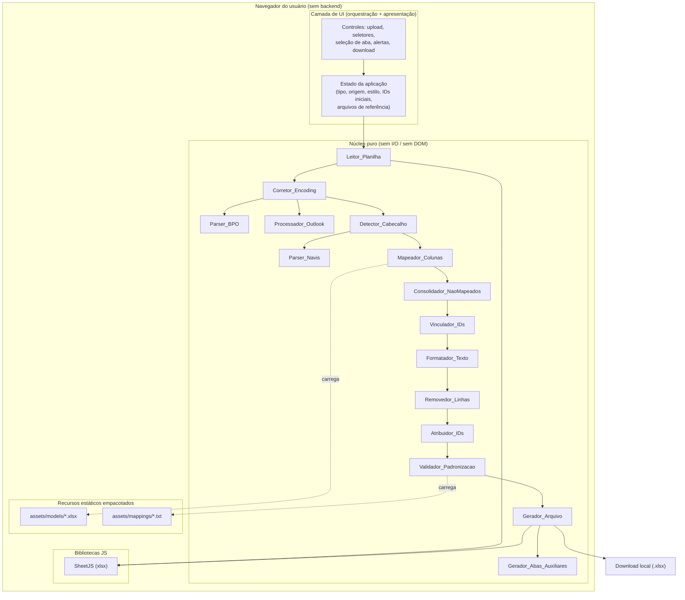
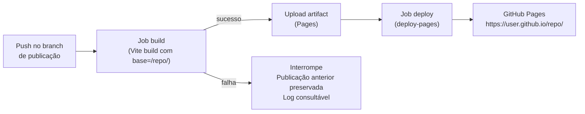

# Design Document

## Overview

O Conversor_Web é uma reescrita do Conversor de Dados DOit — hoje uma aplicação Streamlit/Python — como um **site 100% estático que roda inteiramente no navegador** e é publicável no GitHub Pages. Toda a lógica de negócio hoje em Python (`scripts/conversor.py`, `parser_navis.py`, `parser_bpo.py`, `abas_auxiliares.py` e a orquestração em `dashboards/app_conversor.py`) é portada para JavaScript/TypeScript executado no cliente. Nenhum dado do usuário trafega para servidores externos.

Decisões arquiteturais centrais:

- **Client-side puro**: a leitura/escrita de `.xlsx`/`.xls`/`.csv` usa [SheetJS (`xlsx`)](https://docs.sheetjs.com/), uma biblioteca JavaScript que executa no navegador. Isso substitui `pandas` + `openpyxl` + `xlrd`. (Conteúdo referente à SheetJS foi reescrito para conformidade com licenciamento.)
- **Recursos estáticos empacotados**: os modelos `models/*.xlsx` e as listas `mappings/*.txt` deixam de ser lidos do disco e passam a ser **recursos empacotados com o build** (`assets/models/`, `assets/mappings/`), carregados via `fetch` relativo ao subcaminho de publicação.
- **Núcleo puro isolado da UI**: toda a lógica de transformação é implementada como funções puras (sem I/O, sem DOM), o que a torna testável por propriedades e independente do framework de UI. A UI apenas orquestra chamadas e apresenta resultados/erros.
- **Deploy automatizado**: um workflow GitHub Actions constrói o site e publica no GitHub Pages, com suporte a subcaminho de projeto (`/<repositorio>/`) via base path configurável no bundler.

Escolha de stack: **Vite + TypeScript** como bundler/dev server (gera saída estática pura, suporta `base` para subcaminho, e integra bem com GitHub Actions), **SheetJS** para Excel/CSV, e **Vitest + fast-check** para testes unitários e de propriedade. A UI pode ser construída com componentes leves (TypeScript + DOM/módulo de view simples ou um framework leve); a decisão de framework de UI não afeta o núcleo puro.

## Architecture

### Visão em camadas



### Pipeline de conversão

O fluxo de conversão é uma sequência determinística de transformações sobre uma tabela em memória (`Table`). A ordem reflete o comportamento atual da aplicação Streamlit:

```mermaid
flowchart LR
    A["Arquivo\n(.xlsx/.xls/.csv)"] --> B["Leitor_Planilha\n(seleção de aba)"]
    B --> C["Pré-processamento\npor origem\n(Navis/BPO/Outlook/\nConta Azul)"]
    C --> D["Corretor_Encoding"]
    D --> E["Remoção de linhas\nde exemplo/instrução\n(DOit Coleta)"]
    E --> F["Mapeador_Colunas\n(regra + similaridade)"]
    F --> G["Consolidação de\ncampos não mapeados"]
    G --> H["Vinculador_IDs\n(referências)"]
    H --> I["Formatador_Texto\n(caixa + campos)"]
    I --> J["Remoção de linhas\nsem identificador"]
    J --> K["Atribuidor_IDs\n(ID inicial)"]
    K --> L["Validador_Padronizacao"]
    L --> M["Gerador_Arquivo\n+ abas auxiliares"]
    M --> N["Download .xlsx"]
```



Cada etapa recebe e retorna estruturas de dados imutáveis (a etapa produz uma nova `Table`), o que facilita testes de propriedade e evita efeitos colaterais ocultos. Erros de qualquer etapa são propagados como um `ConversionError` tipado, capturado pela UI para exibição (sem gerar arquivo parcial).

### Estratégia de deploy (GitHub Pages)



O workflow usa as actions oficiais do GitHub Pages (`actions/configure-pages`, `actions/upload-pages-artifact`, `actions/deploy-pages`). O build define `base` = `/<repositorio>/` para que todas as referências a assets (JS, CSS, modelos, mappings) sejam resolvidas relativas ao subcaminho do projeto. Referências a recursos estáticos usam URLs relativas resolvidas via `import.meta.env.BASE_URL`, evitando caminhos absolutos quebrados.

## Components and Interfaces

Todos os componentes do núcleo são funções puras agrupadas por módulo. As assinaturas abaixo usam TypeScript.

### Tipos base

```typescript
// Uma célula pode ser texto, número, booleano, data ou vazio
type Cell = string | number | boolean | Date | null;

// Tabela em memória: cabeçalho + linhas (cada linha é um mapa coluna->valor)
interface Table {
  columns: string[];          // ordem preservada
  rows: Record<string, Cell>[];
}

type DataType =
  | 'contatos' | 'contatos_relacionados' | 'projetos' | 'financeiro'
  | 'horas' | 'usuarios' | 'produtos' | 'vendas';

type SourceSystem =
  | 'doit_coleta' | 'conta_azul' | 'navis' | 'omie' | 'clickup'
  | 'sienge' | 'trello' | 'excel_desestruturado' | 'financeiro_horizontal'
  | 'outlook' | 'excel_manual';

type CaseStyle = 'primeira_maiuscula' | 'maiuscula' | 'original';

interface Alert {
  tipo: 'padronizacao' | 'vinculo' | 'formatacao' | 'campo_nao_mapeado';
  campo?: string;
  valor?: string;
  linha?: number;
  mensagem: string;
}

// Resultado de uma etapa que pode gerar alertas mas não falha
interface StepResult<T> { value: T; alerts: Alert[]; }

// Erro tipado de conversão (interrompe o pipeline)
class ConversionError extends Error {
  constructor(public code: string, message: string) { super(message); }
}
```

### Leitor_Planilha (`reader.ts`)

```typescript
// Lê o arquivo e retorna nomes de abas + tabelas por aba.
// Lança ConversionError para formato/tamanho/vazio/encoding.
function readWorkbook(file: File): Promise<{ sheetNames: string[]; readSheet: (name: string) => Table }>;
function isSupportedExtension(filename: string): boolean; // .xlsx/.xls/.csv, case-insensitive
function readCsv(bytes: ArrayBuffer): Table; // tenta UTF-8, cai para Latin-1
```

Responsabilidades: validar extensão (Req 3.1/3.5) e tamanho ≤ 50 MB (Req 1.6/3.2/3.3), ler abas (Req 3.4), tentar UTF-8 → Latin-1 em CSV (Req 3.7/3.8), rejeitar arquivo vazio (Req 3.6).

### Corretor_Encoding (`encoding.ts`)

```typescript
function fixMojibake(text: string): { fixed: string; corrected: boolean; unresolved: boolean };
function fixTableEncoding(t: Table): StepResult<Table>; // aplica a colunas e valores
```

Porta a lógica de `_corrigir_encoding`/`_corrigir_encoding_df`: detecta marcadores de mojibake (`Ã`, `Â`, sequências), tenta reinterpretação Latin-1 e Windows-1252 (Req 6.3), aplica tabela de substituição, e **preserva byte a byte** textos sem marcador (Req 6.4). Valores não resolvíveis são preservados e sinalizados (Req 6.6).

### Parser_Navis (`parsers/navis.ts`)

```typescript
type NavisReportType =
  | 'financeiro_cc' | 'financeiro_baixados' | 'financeiro_previsao'
  | 'projetos' | 'clientes' | 'fornecedores' | 'contatos' | 'horas' | 'desconhecido';

function detectReportType(raw: Table): NavisReportType;         // analisa 15 primeiras linhas
function detectHeaderRow(raw: Table, keywords: string[]): number; // 20 linhas, maior score
function parseNavis(raw: Table, type: NavisReportType): StepResult<Table>;
```

Porta `parser_navis.py`: detecção por palavras-chave (Req 7.1/7.2), override manual do tipo é responsabilidade da UI que passa o `type` escolhido (Req 7.3), detecção de cabeçalho por maior score (Req 7.5), consolidação de registros multilinha para os formatos ficha e previsão (Req 7.6), retorno vazio tratado (Req 7.7), erro tipado em falha (Req 7.9).

### Parser_BPO (`parsers/bpo.ts`)

```typescript
interface BpoOptions { sheetName: string; ano: number; } // ano inteiro 1900..2100
function detectMonthColumns(raw: Table): Record<number, { inicio: number; fim: number }>;
function parseFinanceiroHorizontal(raw: Table, opts: BpoOptions): StepResult<Table>;
```

Porta `parser_bpo.py`: valida aba/ano (Req 8.1/8.2), detecta colunas dos 12 meses (Req 8.3/8.4), extrai lançamentos por mês com campos data/vencimento/descrição/valor/tipo/conciliado/categorias (Req 8.5), **omite lançamentos com valor vazio/nulo/zero** (Req 8.6), compõe a data a partir do ano informado + mês da coluna (Req 8.7), erro tipado em falha (Req 8.8).

### Processador_Outlook (`processors/outlook.ts`)

```typescript
function concatName(parts: { primeiro?: string; segundo?: string; sobrenome?: string; sufixo?: string }): string;
function distributePhones(principais: (string|null)[], extras: string[]): { campos: string[]; faxComercial: string };
function consolidateExtrasToNotes(row: Record<string, Cell>, mapped: Set<string>, ignored: Set<string>): string;
function processOutlook(t: Table): StepResult<Table>; // aplica 1..6, idêntico para csv/xlsx
```

Porta o pós-processamento Outlook: concatenação de nome com um único espaço e trim (Req 9.1/9.2), distribuição de telefones nos campos principais e excedentes → Fax Comercial separados por `, ` (Req 9.3/9.4), consolidação de extras em Anotações no formato `nome: valor` por linha (Req 9.5), remoção de linhas com nome vazio (Req 9.6), e resultado idêntico entre CSV e XLSX para conteúdo equivalente (Req 9.7).

### Detector_Cabecalho (`header.ts`)

```typescript
function selectSheetByType(sheetNames: string[], type: DataType): string | null; // palavra-chave por tipo
function detectHeaderRow(raw: Table, expectedColumns: string[]): number | null;   // 20 linhas, >=2 matches
function dropInvalidColumns(t: Table): Table; // descarta colunas vazias/só espaços/só numéricas
```

Porta a detecção de cabeçalho do Conta Azul: seleção automática de aba por palavra-chave (Req 10.3/10.4), identificação da primeira linha com ≥2 nomes esperados, comparação case/trim-insensível (Req 10.1/10.2), descarte de colunas vazias/numéricas (Req 10.5).

### Mapeador_Colunas (`mapper.ts`)

```typescript
interface MappingRule { [padrao: string]: string[]; } // coluna destino -> candidatas de origem
function loadModelColumns(type: DataType): Promise<string[]>;   // de assets/models
function getPredefinedRule(source: SourceSystem, type: DataType): MappingRule | undefined;
function similarity(a: string, b: string): number;              // 0..1, normalizado
function mapColumns(source: Table, modelColumns: string[], rule: MappingRule | undefined): StepResult<{ mapping: Record<string,string|null>; unmapped: string[] }>;
```

Porta `MAPEAMENTOS`, `_encontrar_coluna` e `_mapear_automatico`: aplica regra pré-definida (Req 11.1), depois similaridade ≥ 80% ignorando caixa/espaços (Req 5.4/11.2), resolve empates pelo maior grau e depois ordem de ocorrência (Req 11.3), impede reuso de uma coluna de origem (Req 11.4), preenche colunas sem correspondência com string vazia (Req 11.5), sinaliza colunas sem mapeamento automático (Req 5.5). Carrega colunas de modelo (Req 11.6) e falha com erro tipado se o recurso não carrega (Req 5.6/11.8).

### Consolidador_NaoMapeados (`unmapped.ts`)

```typescript
function consolidateUnmapped(t: Table, type: DataType, mapping: Record<string,string|null>, model: string[]): Table;
function detectCellType(value: Cell): 'texto'|'numero'|'data'|'moeda'|'booleano';
```

Porta a consolidação: Cadastros → campo `ANOTAÇÕES` (Req 12.1/12.2); Projetos → distribui em colunas customizáveis por tipo compatível (Req 12.3/12.4); Financeiro/Horas → campo `DESCRIÇÃO` quando existe no modelo (Req 12.5/12.6). Omite colunas sem valores não vazios.

### Vinculador_IDs (`linker.ts`)

```typescript
interface Reference { table: Table; nameColumn: string; idColumn: string; }
function normalizeName(s: string): string; // trim + lowercase
function buildIndex(ref: Reference): { index: Map<string, string|number>; ambiguous: Set<string> };
function linkIds(t: Table, type: DataType, refs: Record<string, Reference>): StepResult<Table>;
```

Porta o vínculo de IDs: Projetos (ID DO CADASTRO, ID LÍDER), Financeiro (ID DE / PARA, ID PROJETO), Contatos Relacionados (ID PAI, ID FILHO) (Req 13.1–13.5); correspondência exata após normalização trim+case (Req 13.8); nome ausente → ID vazio + alerta (Req 13.6); ausência de referência com nomes a vincular → aviso (Req 13.7); ambiguidade → primeiro registro + alerta (Req 13.9); referência sem colunas necessárias → IDs vazios + erro identificando a coluna (Req 13.10).

### Formatador_Texto (`formatter.ts`)

```typescript
function applyCase(text: string, style: CaseStyle): string;         // preposições/artigos minúsculos
function formatPhone(value: Cell): { value: string; ok: boolean };  // +55 (XX) XXXXX-XXXX / XXXX-XXXX
function formatCep(value: Cell): { value: string; ok: boolean };    // XXXXX-XXX (8 dígitos)
function formatDate(value: Cell): { value: string; ok: boolean };   // dd/mm/aaaa
function formatEmail(value: Cell): string;                          // minúsculo, sem espaços
function formatState(value: Cell): string;                          // 2 letras -> maiúsculas
function formatTable(t: Table, style: CaseStyle): StepResult<Table>;
```

Porta `_aplicar_formatacoes`, `_formatar_telefone` etc.: estilos de caixa com preposições/artigos preservados em minúsculo (Req 14.2–14.5), telefone 10/11 dígitos (Req 14.6–14.8), CEP 8 dígitos (Req 14.9/14.10), data reconhecível (Req 14.11/14.12), e-mail minúsculo sem espaços (Req 14.13), estado UF (Req 14.14). Valores não formatáveis são preservados e sinalizados.

### Removedor_Linhas + Atribuidor_IDs (`rows.ts`, `ids.ts`)

```typescript
function removeExampleRows(t: Table, source: SourceSystem): Table;   // DOit Coleta: instruções/exemplos
function removeRowsWithoutIdentifier(t: Table, type: DataType): Table;
function assignIds(t: Table, type: DataType, startId: number): Table; // sequencial a partir do inicial
function validateStartId(value: unknown): { ok: boolean; value?: number }; // inteiro 1..999.999.999
```

Req 16 (remoção de linhas de exemplo/sem identificador, interrupção se vazio) e Req 15 (ID inicial por tipo, sequencial, validação de intervalo com fallback ao último válido).

### Validador_Padronizacao (`validator.ts`)

```typescript
interface StandardLists { [campo: string]: string[]; } // de assets/mappings
function loadStandardLists(): Promise<StandardLists>;
function validateStandardization(t: Table, type: DataType, lists: StandardLists): Alert[];
```

Compara cada campo com lista aplicável ignorando caixa/trim (Req 17.1/17.2), gera alertas por campo/valor/linha (Req 17.3), informa ausência de divergências (Req 17.4), ignora campos sem lista (Req 17.5).

### Gerador_Arquivo + Abas Auxiliares (`generator.ts`, `auxSheets.ts`)

```typescript
function detectBankData(entrada: Table, abas: Record<string, Table>): Record<string,string> | null;
function detectChartOfAccounts(entrada: Table, abas: Record<string, Table>): { table: Table|null; padraoOk: boolean };
function buildPending(saida: Table, alerts: Alert[], planoOk: boolean, unmapped: string[]): Table;
function generateXlsx(saida: Table, type: DataType, aux: { bankData?; chart?; pending? }): Blob;
function triggerDownload(blob: Blob, filename: string): void; // cria object URL e dispara download
```

Porta `abas_auxiliares.py`: produz `.xlsx` no Padrão_DOit com todas as colunas do modelo na ordem/nome corretos (Req 18.1/18.3); para Financeiro inclui abas auxiliares (Dados Bancários, Plano de Contas, Pendências) apenas quando têm ≥1 registro (Req 18.4/18.5); gera integralmente no navegador (Req 18.6); download local via controle visível (Req 18.2); falha na geração → erro sem arquivo parcial, mantendo dados em memória (Req 18.7).

### Camada de UI e estado

A UI mantém o estado (`AppState`) equivalente à sidebar Streamlit: `type`, `source`, `caseStyle`, IDs iniciais por tipo, arquivos de referência para vínculo, seleção de aba, e opções específicas (tipo de relatório Navis, ano BPO). A UI:

- Bloqueia a conversão enquanto tipo/origem não selecionados (Req 4.2, 5.3).
- Carrega/apresenta colunas do modelo ao selecionar tipo (Req 4.3–4.6).
- Apresenta seleção de abas e opções de parser (Req 3.4, 7.3, 8.1, 10.4).
- Exibe alertas e mensagens de erro, e o controle de download (Req 17.3, 18.2).
- Garante inicialização das bibliotecas e recursos, bloqueando conversão em falha (Req 1.7, 11.8).

## Data Models

### Recursos estáticos empacotados

- `assets/models/doit-modelo-*.xlsx` — um por Tipo_De_Dado. Apenas o cabeçalho (primeira linha) é relevante: define a ordem e os nomes das colunas do Padrão_DOit. Carregados via `fetch(BASE_URL + 'assets/models/...')` e lidos com SheetJS.
- `assets/mappings/*.txt` — listas de padronização (uma entrada por linha): `categorias_financeiro`, `categorias_projeto`, `classificacoes_cadastro`, `departamentos_financeiro`, `formas_pagamento`, `status_projeto`, `tipos_endereco`, `tipos_receita_despesa`.

### Mapa de modelos por tipo

| DataType | Arquivo de modelo | Aba principal na saída |
|---|---|---|
| contatos | doit-modelo-contatos.xlsx | Cadastro |
| contatos_relacionados | doit-modelo-contatos-relacionados.xlsx | Contatos Relacionados |
| projetos | doit-modelo-projetos.xlsx | Projetos |
| financeiro | doit-modelo-financeiro.xlsx | Financeiro |
| horas | doit-modelo-horas-trabalhadas.xlsx | Horas |
| usuarios | doit-modelo-usuarios.xlsx | Dados |
| produtos | doit-modelo-produtos.xlsx | Dados |
| vendas | doit-modelo-venda.xlsx | Dados |

### IDs iniciais padrão por tipo

| Tipo | Padrão | Configurável |
|---|---|---|
| contatos | 15 | sim |
| projetos | 2 | sim |
| financeiro | 47 | sim |
| horas | 1 | sim |
| usuarios | 9 | sim |
| contatos_relacionados / produtos / vendas | 1 | não |

### Mapa de padronização campo → lista

| Campo (saída) | Lista aplicável |
|---|---|
| CLASSIFICAÇÃO (contatos) | classificacoes_cadastro |
| TIPO DE ENDEREÇO n | tipos_endereco |
| STATUS (projetos) | status_projeto |
| CATEGORIA (projetos) | categorias_projeto |
| 1ª/2ª/3ª CATEGORIA (financeiro) | categorias_financeiro |
| DEPARTAMENTO (financeiro) | departamentos_financeiro |
| FORMA DE PAGAMENTO (financeiro) | formas_pagamento |
| TIPO / TIPO DE RECEITA/DESPESA (financeiro) | tipos_receita_despesa |

### Estruturas das abas auxiliares (Financeiro)

- **Dados Bancários**: pares `Campo | Valor` (Favorecido, CNPJ/CPF, Banco, Agência, Conta, Tipo de Conta, Chave PIX).
- **Plano de Contas**: `Tipo | 1ª Categoria | 2ª Categoria | 3ª Categoria` (hierárquico) ou tabela original marcada como fora do padrão.
- **Pendências**: `Tipo | Descrição | Ação Necessária` consolidando alertas de padronização, plano fora do padrão, campos não mapeados e campos obrigatórios vazios.

## Correctness Properties

*Uma propriedade é uma característica ou comportamento que deve ser verdadeiro em todas as execuções válidas de um sistema — essencialmente, uma afirmação formal sobre o que o sistema deve fazer. Propriedades servem como ponte entre especificações legíveis por humanos e garantias de correção verificáveis por máquina.*

O núcleo de transformação do Conversor_Web é composto por funções puras, o que o torna adequado a testes baseados em propriedades. As propriedades abaixo foram derivadas da análise de prework das 18 áreas de requisitos. Critérios de aceitação puramente arquiteturais (execução client-side, ausência de backend), de deploy (GitHub Actions/Pages) e de apresentação de UI não geram propriedades — são cobertos por smoke tests, verificação de build e testes de exemplo (ver Testing Strategy).

### Property 1: Correção de mojibake recupera acentuação e elimina marcadores

*Para todo* texto acentuado UTF-8, ao ser corrompido em mojibake (interpretação incorreta como Latin-1 ou como Windows-1252), a correção de encoding deve recuperar o texto acentuado original, e a tabela resultante não deve conter marcadores de mojibake corrigíveis, tanto em nomes de coluna quanto em valores.

**Validates: Requirements 6.1, 6.2, 6.3, 6.5**

### Property 2: Textos sem marcador de mojibake são preservados

*Para todo* texto que não contém nenhum marcador de mojibake, a correção de encoding deve retornar o texto inalterado, byte a byte.

**Validates: Requirements 6.4**

### Property 3: Extensões de arquivo são aceitas de forma insensível à caixa

*Para todo* nome de arquivo, o leitor deve aceitá-lo se e somente se sua extensão, comparada de forma insensível a maiúsculas/minúsculas, for `.xlsx`, `.xls` ou `.csv`, rejeitando qualquer outra extensão.

**Validates: Requirements 3.1, 3.5**

### Property 4: Seleção de aba lista todas as abas e usa a primeira como padrão

*Para todo* conjunto não vazio de abas de uma planilha, o leitor deve apresentar exatamente a mesma lista de abas e selecionar a primeira como padrão até que outra seja escolhida.

**Validates: Requirements 3.4**

### Property 5: Leitura de CSV recupera texto Latin-1 quando UTF-8 falha

*Para todo* texto contendo caracteres acentuados, ao ser codificado em Latin-1 (de modo que a decodificação UTF-8 falhe), o leitor de CSV deve recuperar o texto original ao cair para a decodificação Latin-1.

**Validates: Requirements 3.7**

### Property 6: Mapeamento por similaridade respeita o limiar e o desempate

*Para toda* coluna de destino sem regra pré-definida aplicável, o mapeador deve associá-la a uma coluna de origem apenas quando a similaridade de nome (ignorando caixa e espaços nas extremidades) for igual ou superior a 80%, escolhendo, entre as candidatas acima do limiar, a de maior grau de similaridade e, em caso de empate, a primeira em ordem de ocorrência; se nenhuma atinge o limiar, a coluna permanece sem mapeamento automático e é sinalizada.

**Validates: Requirements 5.4, 5.5, 11.2, 11.3**

### Property 7: Regra pré-definida mapeia para a coluna candidata existente

*Para toda* regra de mapeamento pré-definida e toda Planilha_Origem que contenha uma coluna candidata declarada na regra, o mapeador deve associar a coluna de destino à coluna de origem candidata correspondente.

**Validates: Requirements 11.1**

### Property 8: O mapeamento é injetivo nas colunas de origem

*Para todo* resultado de mapeamento, nenhuma coluna da Planilha_Origem deve estar associada a mais de uma coluna do Padrão_DOit.

**Validates: Requirements 11.4**

### Property 9: Colunas de destino sem correspondência recebem valor vazio

*Para toda* coluna do Padrão_DOit que não recebeu correspondência por regra nem por similaridade, a coluna resultante deve conter string vazia em todas as linhas.

**Validates: Requirements 11.5**

### Property 10: Detecção de cabeçalho seleciona a linha de maior correspondência

*Para toda* planilha com uma linha de cabeçalho plantada entre as primeiras 20 linhas contendo pelo menos 2 dos nomes esperados (comparação insensível a caixa/espaços), o detector deve identificar essa linha como cabeçalho.

**Validates: Requirements 10.1, 7.5**

### Property 11: Seleção de aba por palavra-chave do tipo

*Para todo* conjunto de nomes de aba em que exatamente uma contém a palavra-chave associada ao Tipo_De_Dado (comparação insensível a caixa/espaços), o detector deve selecionar essa aba.

**Validates: Requirements 10.3**

### Property 12: Descarte de colunas inválidas na detecção de cabeçalho

*Para todo* cabeçalho detectado, o detector deve remover todas as colunas cujo nome seja vazio, composto apenas por espaços ou composto exclusivamente por caracteres numéricos, mantendo todas as demais.

**Validates: Requirements 10.5**

### Property 13: O parser Navis usa o tipo de relatório escolhido

*Para todo* tipo de relatório Navis selecionado, o parser deve extrair registros usando o extrator correspondente a esse tipo, independentemente do tipo detectado automaticamente.

**Validates: Requirements 7.3**

### Property 14: Validação do ano de referência do BPO

*Para todo* valor informado como ano de referência, o parser BPO deve aceitá-lo se e somente se for um inteiro no intervalo de 1900 a 2100, rejeitando qualquer outro valor sem gerar saída.

**Validates: Requirements 8.2**

### Property 15: Detecção de colunas de meses do BPO

*Para todo* layout horizontal em que um subconjunto dos 12 meses é plantado como cabeçalhos de bloco, o parser BPO deve detectar exatamente os meses presentes.

**Validates: Requirements 8.3**

### Property 16: Lançamentos do BPO têm todos os campos requeridos

*Para toda* planilha BPO válida, cada lançamento extraído deve conter os campos data, vencimento, descrição, valor, tipo, conciliado e categorias.

**Validates: Requirements 8.5**

### Property 17: Lançamentos com valor vazio, nulo ou zero são omitidos

*Para toda* planilha BPO, a saída não deve conter nenhum lançamento cujo valor seja vazio, nulo ou igual a zero.

**Validates: Requirements 8.6**

### Property 18: Composição da data a partir do ano informado e do mês da coluna

*Para todo* lançamento do BPO sem data de vencimento própria, a data composta deve ter ano igual ao ano de referência informado e mês igual ao mês da coluna de origem do lançamento.

**Validates: Requirements 8.7**

### Property 19: Concatenação de nome do Outlook preserva ordem sem espaços supérfluos

*Para todo* conjunto de componentes de nome (Primeiro nome, Segundo nome, Sobrenome, Sufixo), o nome concatenado deve conter os componentes preenchidos na ordem definida, separados por um único espaço, sem espaços consecutivos e sem espaços nas extremidades, omitindo os componentes vazios.

**Validates: Requirements 9.1, 9.2**

### Property 20: Distribuição de telefones do Outlook preenche principais e transborda para Fax

*Para toda* lista de telefones e conjunto de campos principais de telefone, a distribuição deve preencher os campos principais vazios na ordem de ocorrência; os telefones que excederem a quantidade de campos principais devem ser consolidados no campo Fax Comercial, na ordem, separados por vírgula seguida de espaço.

**Validates: Requirements 9.3, 9.4**

### Property 21: Consolidação de campos não mapeados inclui apenas valores preenchidos

*Para todo* conjunto de colunas de origem não mapeadas, a consolidação no campo de destino (Anotações para Cadastros/Outlook; Descrição para Financeiro/Horas quando o campo existe) deve incluir cada valor não vazio precedido do nome de sua coluna no formato "nome: valor", separados por um delimitador único e consistente, omitindo integralmente as colunas sem nenhum valor não vazio.

**Validates: Requirements 9.5, 12.1, 12.2, 12.5**

### Property 22: Distribuição de não mapeados em colunas customizáveis por tipo (Projetos)

*Para todo* conjunto de colunas de origem não mapeadas com valores não vazios no Tipo_De_Dado Projetos, cada coluna deve ser distribuída em uma coluna customizável cujo tipo (texto, número, data, moeda ou booleano) corresponda ao conteúdo da coluna, respeitando a ordem de disponibilidade das colunas customizáveis.

**Validates: Requirements 12.3**

### Property 23: Linhas com nome vazio são removidas (Outlook)

*Para toda* tabela processada pelo Outlook, o resultado não deve conter nenhuma linha cujo campo de nome esteja vazio ou contenha apenas espaços após a concatenação.

**Validates: Requirements 9.6**

### Property 24: Equivalência entre entradas CSV e XLSX do Outlook

*Para todo* conjunto de dados de contatos, o pós-processamento do Outlook deve produzir resultado idêntico quer a entrada tenha vindo de um `.csv` quer de um `.xlsx` com conteúdo equivalente.

**Validates: Requirements 9.7**

### Property 25: Vínculo de IDs por nome normalizado

*Para toda* planilha de referência (nome → ID) e toda tabela cujos nomes existam na referência, o vinculador deve preencher a coluna de ID correspondente com o ID associado ao nome, considerando dois nomes equivalentes quando iguais após remoção de espaços nas extremidades e comparação insensível a maiúsculas/minúsculas.

**Validates: Requirements 13.1, 13.2, 13.3, 13.4, 13.5, 13.8**

### Property 26: Nomes ausentes na referência resultam em ID vazio e alerta

*Para todo* nome preenchido que não exista na planilha de referência, o vinculador deve deixar o ID correspondente vazio e incluir esse nome na lista de alertas de nomes não encontrados.

**Validates: Requirements 13.6**

### Property 27: Nome ambíguo usa o primeiro registro e gera alerta

*Para todo* nome que corresponda a mais de um registro na referência, o vinculador deve preencher o ID com o ID do primeiro registro correspondente e incluir esse nome na lista de alertas de correspondência ambígua.

**Validates: Requirements 13.9**

### Property 28: Estilo Primeira Maiúscula capitaliza palavras preservando preposições e artigos

*Para toda* frase, o estilo Primeira Maiúscula deve iniciar cada palavra em maiúscula com as demais letras em minúscula, mantendo em minúsculo as preposições e artigos (de, da, do, das, dos, e, a, o, as, os) quando não forem a primeira palavra do campo.

**Validates: Requirements 14.2**

### Property 29: Estilo TUDO MAIÚSCULO equivale à conversão integral para maiúsculas

*Para todo* campo de texto, o estilo TUDO MAIÚSCULO deve produzir exatamente a versão em maiúsculas do texto de entrada.

**Validates: Requirements 14.3**

### Property 30: Estilo Original preserva o texto

*Para todo* campo de texto, o estilo Original deve preservar o valor de entrada sem alteração de caixa.

**Validates: Requirements 14.4**

### Property 31: Formatação de telefone de 11 dígitos

*Para toda* sequência que contenha exatamente 11 dígitos de assinante (independentemente de caracteres não numéricos intercalados), o formatador de telefone deve produzir o padrão `+55 (XX) XXXXX-XXXX`.

**Validates: Requirements 14.6**

### Property 32: Formatação de telefone de 10 dígitos

*Para toda* sequência que contenha exatamente 10 dígitos de assinante (independentemente de caracteres não numéricos intercalados), o formatador de telefone deve produzir o padrão `+55 (XX) XXXX-XXXX`.

**Validates: Requirements 14.7**

### Property 33: Formatação de CEP de 8 dígitos

*Para toda* sequência que contenha exatamente 8 dígitos numéricos, o formatador de CEP deve produzir o padrão `XXXXX-XXX`.

**Validates: Requirements 14.9**

### Property 34: Formatação de data reconhecível

*Para todo* valor de data reconhecível, o formatador deve produzir o texto no padrão `dd/mm/aaaa` correspondente à data.

**Validates: Requirements 14.11**

### Property 35: Formatação de e-mail

*Para todo* valor de e-mail, o formatador deve produzir o texto em letras minúsculas e sem espaços.

**Validates: Requirements 14.13**

### Property 36: Formatação de sigla de estado

*Para todo* valor de estado, quando contém exatamente duas letras o formatador deve produzi-lo em maiúsculas; caso contrário deve preservar o valor original.

**Validates: Requirements 14.14**

### Property 37: Validação de ID inicial por intervalo

*Para todo* valor informado como ID inicial, o Conversor_Web deve aceitá-lo se e somente se for um inteiro no intervalo de 1 a 999.999.999; ao rejeitar, deve manter o último ID inicial válido definido para o Tipo_De_Dado.

**Validates: Requirements 15.4, 15.5**

### Property 38: Atribuição de IDs sequenciais a partir do ID inicial

*Para toda* tabela com coluna ID e todo ID inicial válido, os IDs atribuídos devem ser inteiros consecutivos começando no ID inicial e incrementando de 1 em 1 na ordem das linhas.

**Validates: Requirements 15.2**

### Property 39: Remoção de linhas sem identificador preserva as demais

*Para toda* tabela, a remoção de linhas inválidas deve eliminar exatamente as linhas em que todos os campos de identificação do Tipo_De_Dado estão vazios ou só com espaços, preservando todas as linhas que possuem ao menos um identificador preenchido.

**Validates: Requirements 16.2, 16.3**

### Property 40: Detecção de divergências de padronização

*Para todo* campo do Arquivo_Convertido que possui lista de padronização aplicável, o validador deve gerar alerta exatamente para os valores não vazios que não correspondem a nenhum item da lista (ignorando caixa e espaços nas extremidades), e não deve gerar alerta para campos sem lista aplicável nem para valores presentes na lista.

**Validates: Requirements 17.1, 17.2, 17.5**

### Property 41: Round-trip de estrutura do arquivo gerado

*Para toda* tabela de saída no Padrão_DOit, ao gerar o `.xlsx` e relê-lo, o cabeçalho da aba principal deve conter exatamente as colunas do modelo correspondente, na mesma ordem e com os mesmos nomes, e os valores das células devem ser preservados.

**Validates: Requirements 18.1, 18.3**

### Property 42: Presença condicional de abas auxiliares (Financeiro)

*Para todo* conjunto auxiliar (Dados Bancários, Plano de Contas, Pendências) no Tipo_De_Dado Financeiro, a aba correspondente deve estar presente no Arquivo_Convertido se e somente se o conjunto contiver ao menos um registro.

**Validates: Requirements 18.4, 18.5**

## Error Handling

Todos os erros que devem interromper a conversão são modelados como `ConversionError` com um `code` estável, capturados pela camada de UI e traduzidos em mensagens ao usuário. Erros nunca produzem arquivo parcial e preservam o estado/dados anteriores para nova tentativa.

| Código | Origem | Requisito | Comportamento |
|---|---|---|---|
| `FILE_TOO_LARGE` | Leitor | 1.6, 3.3 | Rejeita arquivo > 50 MB, mensagem de limite, estado preservado |
| `UNSUPPORTED_FORMAT` | Leitor | 3.5 | Extensão não suportada, sem carregar dados |
| `EMPTY_FILE` | Leitor | 3.6, 16.4 | Sem linhas de dados, interrompe conversão |
| `CSV_ENCODING` | Leitor | 3.8 | Falha em UTF-8 e Latin-1 |
| `LIB_INIT_FAILED` | Init | 1.7 | Biblioteca Excel não carregou, bloqueia conversão |
| `MODEL_LOAD_FAILED` | Mapeador | 4.6, 11.8 | Modelo do tipo ausente/ilegível |
| `MAPPINGS_LOAD_FAILED` | Validador | 11.8 | Lista de padronização ausente/ilegível |
| `RULE_UNAVAILABLE` | Mapeador | 5.6 | Regras da origem indisponíveis, entrada preservada |
| `NAVIS_UNKNOWN_TYPE` | Parser Navis | 7.2 | Tipo de relatório não identificado |
| `NAVIS_PARSE_FAILED` | Parser Navis | 7.9 | Falha de interpretação, origem preservada |
| `BPO_INVALID_INPUT` | Parser BPO | 8.2 | Aba/ano ausente ou ano fora de 1900..2100 |
| `BPO_NO_MONTHS` | Parser BPO | 8.4 | Estrutura de colunas mensais não encontrada |
| `BPO_PARSE_FAILED` | Parser BPO | 8.8 | Falha de interpretação |
| `REFERENCE_MISSING_COLUMNS` | Vinculador | 13.10 | Referência sem colunas de nome/ID necessárias |
| `INVALID_START_ID` | UI/IDs | 15.5 | ID inicial inválido, mantém último válido |
| `GENERATION_FAILED` | Gerador | 18.7 | Falha na geração, sem arquivo parcial, dados mantidos |

Situações **não fatais** geram `Alert`s acumulados (não interrompem): nomes não encontrados/ambíguos no vínculo (13.6/13.9), telefone/CEP/data não formatáveis (14.8/14.10/14.12), mojibake não resolvível (6.6), colunas não mapeadas (5.5) e divergências de padronização (17.2). Os alertas são apresentados juntos ao final e, no Financeiro, também consolidados na aba Pendências.

Casos de detecção que exigem intervenção do usuário (não são erros) devolvem um estado que a UI trata solicitando escolha manual: cabeçalho não identificável (10.2) e aba não identificável (10.4) apresentam seleção manual.

## Testing Strategy

### Abordagem dupla

- **Testes de propriedade** (Vitest + fast-check) cobrem o núcleo puro de transformação — as 42 propriedades acima. São a principal defesa de correção sobre o amplo espaço de entradas (textos, planilhas, nomes de coluna, telefones, datas).
- **Testes unitários / de exemplo** cobrem: listas fixas de UI (tipos, origens, estilos — Req 4.1, 5.1, 14.1), guardas de estado (Req 4.2, 5.3), classificação de relatório Navis por amostras (Req 7.1, 7.4, 7.6), remoção de linhas de exemplo do DOit Coleta (Req 16.1), compatibilidade tipo×relatório (Req 7.8), condições de erro tipadas (tabela acima), disparo de download (Req 18.2) e mensagens de ausência de divergência (Req 17.4).
- **Edge cases** são cobertos pelos geradores das propriedades (fronteiras de tamanho de arquivo, contagens de dígitos de telefone/CEP diferentes de 10/11/8, datas não reconhecíveis, valores fora de intervalo de ano/ID, mojibake ambíguo, colunas vazias/numéricas, tabelas só com cabeçalho).

### Biblioteca de PBT e configuração

- Biblioteca: **fast-check** (não implementar PBT do zero).
- Mínimo de **100 iterações** por teste de propriedade (`fc.assert(prop, { numRuns: 100 })`).
- Cada teste de propriedade referencia sua propriedade de design com a tag no formato:
  `// Feature: conversor-web-github-pages, Property {número}: {texto da propriedade}`
- Cada propriedade de correção é implementada por **um único** teste de propriedade.
- Geradores customizados representam o domínio: `arbTable`, `arbColumnName`, `arbAcentText` (texto com acentos), `arbMojibake` (aplica corrupção utf8→latin1/cp1252), `arbPhoneDigits`, `arbBpoSheet`, `arbNavisSheet`, `arbReference`.

### Testes de deploy, assets e client-side (não PBT)

- **Verificação de build**: o build gera apenas HTML/CSS/JS estático (Req 1.2, 2.1) e referencia assets via base path do subcaminho (Req 2.5); checado por inspeção da saída de build e teste de que URLs de assets usam `BASE_URL`.
- **Workflow**: existência e validade do arquivo GitHub Actions (Req 2.6) e comportamento de build→deploy / falha→preserva (Req 2.2–2.4) verificados por execução do workflow (integração), não por PBT.
- **Carregamento de recursos** (Req 11.6, 11.7, 4.3): testes de integração que carregam `assets/models/*.xlsx` e `assets/mappings/*.txt` empacotados e verificam colunas/listas.
- **Ausência de tráfego de dados** (Req 1.1, 1.3, 1.4, 18.6): revisão arquitetural e teste de que o núcleo não realiza chamadas de rede com dados do usuário (mock de `fetch` — nenhuma chamada com conteúdo da planilha).
- **Performance** (Req 3.2): teste com arquivo representativo ≤ 50 MB confirmando leitura em até 30 s.
